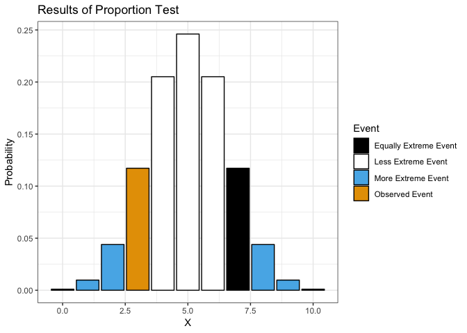
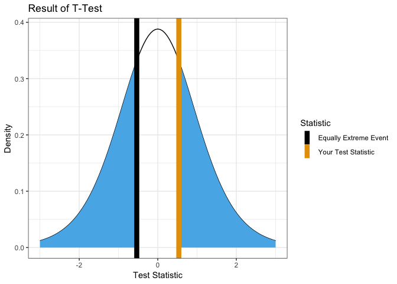
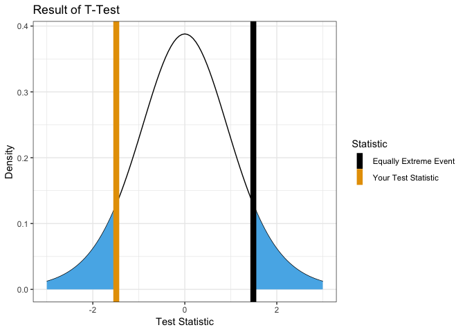
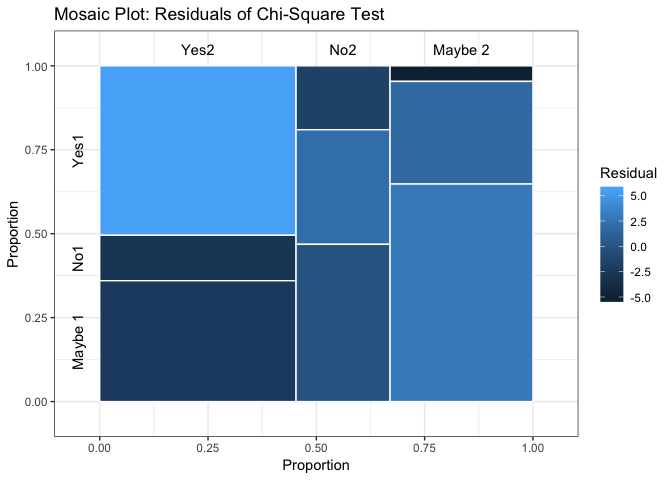
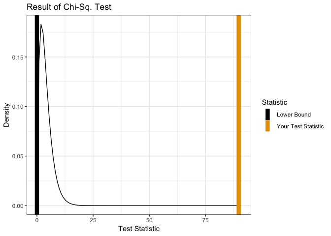
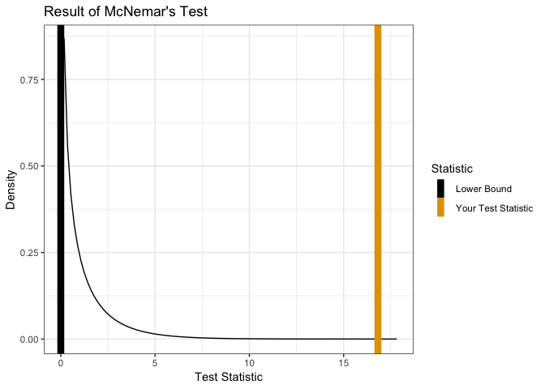
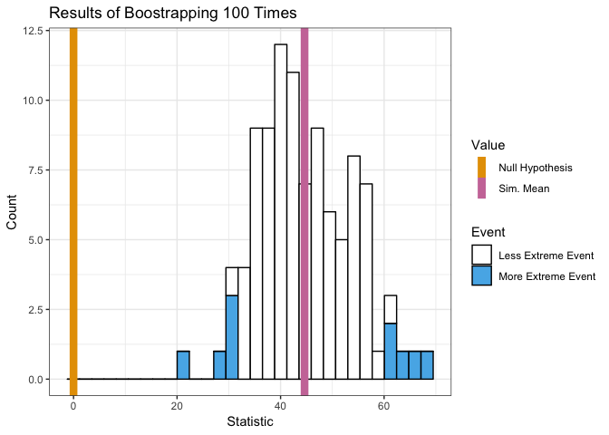
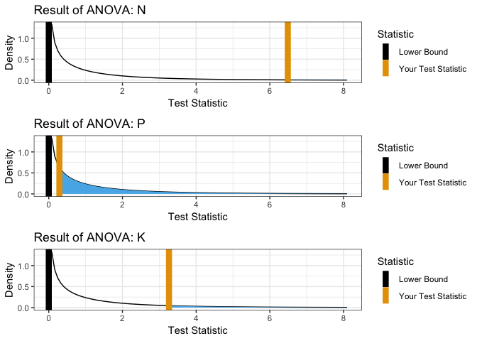
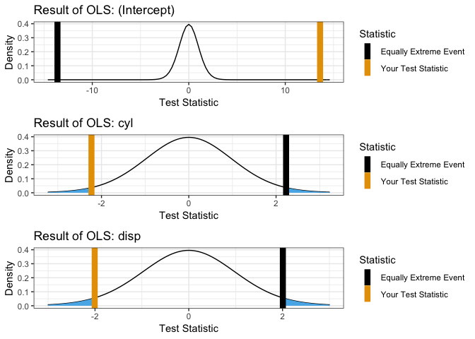

mcStats
================

This package is used to visualize distributions in relation to traditional hypothesis tests. We have found that students are capable of interpreting p-values, but often struggle with understanding how they relate to the underlying distribution. The stats package performs statistical tests while we visualize the results.

Hypothesis Tests
================

Proportion Test
---------------

``` r
showProp.Test(3, 10)
```



    ## 
    ##  Exact binomial test
    ## 
    ## data:  x and n
    ## number of successes = 3, number of trials = 10, p-value = 0.3438
    ## alternative hypothesis: true probability of success is not equal to 0.5
    ## 95 percent confidence interval:
    ##  0.06673951 0.65245285
    ## sample estimates:
    ## probability of success 
    ##                    0.3

T-Test
------

### One Sample

Test with null hypothesis mean = 0.

``` r
x <- rnorm(10)
showT.Test(x)
```



    ## 
    ##  One Sample t-test
    ## 
    ## data:  group1
    ## t = -0.97931, df = 9, p-value = 0.353
    ## alternative hypothesis: true mean is not equal to 0
    ## 95 percent confidence interval:
    ##  -0.9367283  0.3707214
    ## sample estimates:
    ##  mean of x 
    ## -0.2830035

Test with nullhypothesis mean = 0.5.

``` r
showT.Test(x, mu = 0.5)
```



    ## 
    ##  One Sample t-test
    ## 
    ## data:  group1
    ## t = -2.7095, df = 9, p-value = 0.02402
    ## alternative hypothesis: true mean is not equal to 0.5
    ## 95 percent confidence interval:
    ##  -0.9367283  0.3707214
    ## sample estimates:
    ##  mean of x 
    ## -0.2830035

### Two Sample

    y <- rnorm(10, mean = 0.1)
    showT.Test(x,y)

Chi-Square Test
---------------

### Mosaic Plot

``` r
x <- matrix(runif(9,5,100), ncol = 3, dimnames = list(c("Yes1", "No1", "Maybe 1"),
                                                      c("Yes2", "No2", "Maybe 2")))
mosaicplot(x)
```



### Distribution

``` r
showChiSq.Test(x)
```



    ## 
    ##  Pearson's Chi-squared test
    ## 
    ## data:  x
    ## X-squared = 20.445, df = 4, p-value = 0.0004078

McNemar Test
------------

``` r
Performance <-
  matrix(c(794, 86, 150, 570),
         nrow = 2,
         dimnames = list("1st Survey" = c("Approve", "Disapprove"),
                         "2nd Survey" = c("Approve", "Disapprove")))
showMcNemarTest(Performance)
```



    ## 
    ##  McNemar's Chi-squared test with continuity correction
    ## 
    ## data:  x
    ## McNemar's chi-squared = 16.818, df = 1, p-value = 4.115e-05

Bootstrap
=========

``` r
bootstrap(mean, x, 0, 100)
```



    ##   [1] 54.90774 51.07035 62.03353 59.45124 42.65071 53.54602 58.19805
    ##   [8] 49.23022 42.80682 48.37725 55.93226 43.66260 38.76233 37.54761
    ##  [15] 48.67384 42.42315 64.43235 68.48759 55.88688 54.98819 45.01146
    ##  [22] 44.32679 44.94303 52.94193 40.54650 47.56330 46.70979 42.63162
    ##  [29] 34.53033 64.46052 42.53795 46.94533 41.18465 36.09311 48.51360
    ##  [36] 50.08601 58.49279 44.25783 47.79896 45.98412 63.10048 50.72895
    ##  [43] 62.70815 70.40356 44.79826 44.72806 55.45402 44.30009 48.20786
    ##  [50] 42.41185 59.92486 43.56006 43.01403 32.92129 49.30569 36.82319
    ##  [57] 46.08493 51.61663 51.93606 58.78356 26.15019 69.00779 59.82237
    ##  [64] 49.10645 56.87518 50.13957 49.68720 33.95228 51.20886 44.01459
    ##  [71] 66.88024 38.29459 63.04476 45.01572 56.02155 61.85452 56.19405
    ##  [78] 55.77186 49.30737 43.08087 44.30009 37.41971 55.21450 41.24469
    ##  [85] 49.87103 68.78172 47.83253 50.72265 48.07421 52.72435 48.62027
    ##  [92] 40.54171 55.14868 51.01445 43.22471 50.76491 54.59131 50.19763
    ##  [99] 55.68494 57.43471

ANOVA
=====

``` r
showANOVA(yield ~  N + P + K, npk)
```



OLS
===

``` r
showOLS(mpg ~ cyl + disp, mtcars)
```


